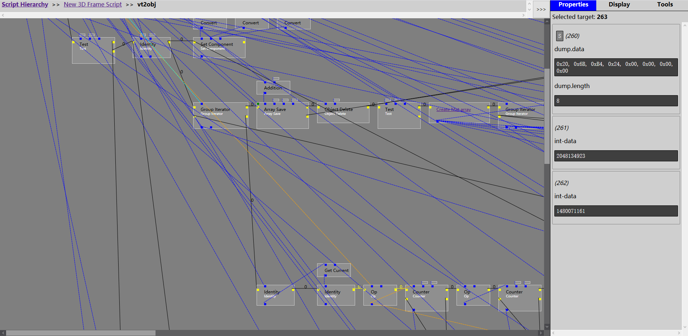

# Super Script Materializer

[中文文档](./README_ZH.md)

---

---

The project consist of two parts:

  1. SuperScriptMaterializer - Custom Virtools Interface Plugin that allows you to export all scripts/schematics into a SQLite database file
  2. SuperScriptViewer - a python parser that creates a web page based on the exported databases to view the schematic in Behavior Graph mode similar to how Virtools Dev displays.

The purpose of the project is to allow users to have a backup graph of their scripts from Virtools while providing support for analyzing `--Script Hidden--` scripts by decoding the bytecode of `.NMS` virtools files from `.CMO` and `.VMO`. 

The inspiration came from:
  - [BearKidsTeam/Script-Materializer](https://github.com/BearKidsTeam/Script-Materializer) - Allows exporting specific scripts into a JSON file
  - [BearKidsTeam/VirtoolsScriptDeobfuscation](https://github.com/BearKidsTeam/VirtoolsScriptDeobfuscation) - A custom interface plugin that loads `.CMO` files with hidden scripts and makes them visible and editable.

**NOTE:**

* This project does not give ability to edit hidden scripts within the file. It simply exports and views.
* The latest commit may not be stable to use, please visit the Release page to get a stable version.
* The development cycle of this program is very long. If you use a version before the first official version, you need to rebuild all the data because the previous version is not compatible with the official version.

## Requirements

  - Virtools Dev 5.0 with SDK (May work for others, Virtools 4 has been tested and can be compiled and run without any modification)
  - Python 3.0 with Flask module
  - Common browsers (except Safari)
  - Visual Studio 2015 with at least v140 toolset

## Build

  1. Download repository.
  2. Get SQLite SDK (amalgamation) and binaries (sqlite-dll-win32-x86) from [sqlite.org](http://www.sqlite.org/)
  3. Extract both SQLite SDK and binaries to the same folder.
  4. Open Developer Command Prompt for VS 2015 by typing Developer Command in Windows Search
  5. Go to directory where you've extracted SDK and binaries and type `lib /DEF:sqlite3.def /OUT:sqlite3.lib /MACHINE:x86` which will build a lib file for SQLite.
  6. Open SuperScriptMaterializer solution.
  7. Edit SuperScriptMaterializer Properties page as necessary:
     - General -> Target Platform Version
     - General -> Output Directory
     - General -> Platform Toolset
     - C/C++ -> General -> Additional Include Directories (Add your SQLite path and Virtools Includes Path)
     - Linker -> General -> Output File
     - Linker -> General -> Additional Library Dependencies (Add your SQLite path and Virtools Lib/Win32/Release Path)
     - Linker -> Debugging -> Generate Program Database File
  8. Clean and Build as Release

## Usage

### Exporting Scripts from Virtools

  1. Make Sure Virtools Dev is closed.
  2. Copy compiled SuperScriptMaterializer.dll into Virtools's InterfacePlugins folder. Copy `sqlite3.dll` you downloaded into Virtool's base folder (where `devr.exe` exist). If you use the packaged file on the Release page, just decompress it directly in the root directory of Virtools and allow folder merging and file overwriting.
  3. Open Virtools and load a `.CMO` of your choice.
  4. Go to the menu bar and click `Super Script Materializer` and `Export all script`. Name it `export.db` and save it into `SuperScriptViewer` folder
  5. Go to the menu bar and click `Super Script Materializer` and `Export environment`. Name it `env.db` and save it into `SuperScriptViewer` folder

### Viewing Exported Databases

  1. Run the viewer by `python3 SuperScriptViewer.py`
  2. It will generate a unique decorated database (`decorated.db`) used for viewing based on `export.db` and `env.db`
  3. Once generated, a webpage will be hosted (default 127.0.0.1:5000) to view all graphs.

There is advanced command line switches if needed for the SuperScriptViewer
  - `-i filename.db` specify an input file to be used as `export.db`
  - `-e filename.db` specify an input file to be used as `env.db`
  - `-o filename.db` specify an output file to generate `decorated.db`. If it already exists, it will used that instead of generating a new one.
  - `-c encoding_name` specify database encoding. The list of supported encodings can be viewed [here](https://docs.python.org/3/library/codecs.html#standard-encodings)
  - `-f` forces the output database to be regenerated (useful if you are unsure if decorated.db matches what export.db and env.db used)

A document instructing you how to use the SuperScriptViewer is built into the SuperScriptViewer and can be viewed from the Help page.

## Troubleshooting

  - If `SuperScriptViewer.py` displays `TEXT` type decoding error, you will need to use switch `-c` to whatever encoding system your OS uses since Virtools uses multi-byte encoding and depends on your system's locale. It should be noted that the specified encoding is not the current code page of your computer, but the code page of the author who made this Virtools document.
  - If Virtools or SuperScriptViewer show an error window or message, please create an issues page noting what Virtools version you have, a link to your file you used to export and the error message.

## Development plan

In subsequent versions, the following features will be gradually added:

* Current page search and global search
* Shortcut tracking
* Move Block and BB in Viewer
