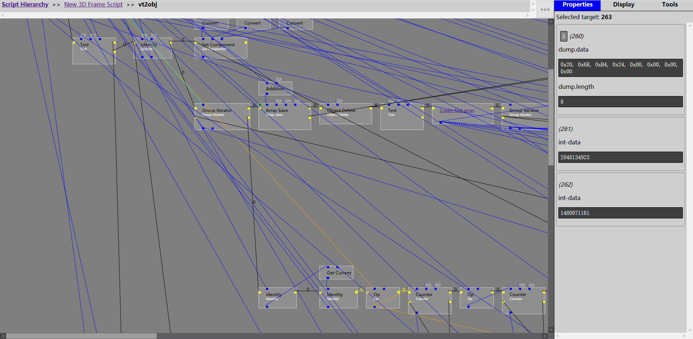

# Super Script Materializer

[English document](./README.md)

---



---

## 简介

超级Virtools脚本物化器（机翻（确信））

本项目分为3个部分：

* `SuperScriptMaterializer`：一个C++工程，将生成一个Virtools界面插件或独立播放器用于导出初步数据。
* `SuperScriptDecorator`：一个Python工程，将解析导出的数据，并将其组合成易于浏览的格式。
* `SuperScriptViewer`：一个Python工程，使用Flask提供一个本地Web界面进行脚本以供快速查看。

整个工程所作的事情就是，将Virtools文档中的所有脚本导出成一个SQLite数据库文件（`Materializer`所做的任务），然后经过Python进行排布处理（`Decorator`所做的任务），最后提供一个本地Web前端查看脚本（`Viewer`所做的任务）。整个的查看流程比较复杂，涉及到多个软件的操作。希望您能继续阅读下面比较概要操作说明，以获得良好的使用体验。

物化器同样适用于`Script Hidden`的Virtools脚本，也适用于其中含有不可展开的`Behavior Graph`的脚本。物化器不能完全恢复脚本的原有排布，无论原有排布是否存在，物化器都将重新自动生成脚本中的各个元素的位置。某些结构的关系可能会改变（例如Export parameter），亦或者是与Virtools中的呈现不同，但是逻辑思路将不会改变。同时物化器不能将已经生成的结构回写成Virtools可接受的格式，因此物化器只能提供无视脚本隐藏的分析功能。

**注意事项**

* 当前最新的commit并不一定可以稳定使用，请访问Release界面获取可以稳定使用的版本。
* 如果您更换了使用的版本（包括第一个稳定版本之前的版本），则需要重新构建所有数据，因为各个版本之间的数据可能彼此不兼容。

## SuperScriptMaterializer

SuperScriptMaterializer分为两种类型，一种是*插件*模式，在Virtools内部，作为界面插件，由人手动点击菜单进行导出，一般用于本地快速查看。另一种是*独立*模式，使用独立的Virtools编译器加载文件并导出，通过命令行参数的方式获得需要解析的文件和解析后数据库的路径，一般用于编写Shell脚本批量进行脚本导出。目前，我们支持的Virtools版本和模式如下：

|已知的Virtools版本|插件模式|独立模式|
|:---|:---|:---|
|Virtools 2.1|× (0)|√ (1)|
|Virtools 2.5|× (2)|√ (4)|
|Virtools 3.0|× (3)|× (3)|
|Virtools 3.5|√|√|
|Virtools 4.0|√|√ (4)|
|Virtools 5.0|√|√|

0. 没有可用的Virtools Dev 2.1，因此没有插件模式  
0. 使用Ballance Mod Loader提供的逆向Virtools SDK进行编译  
0. Virtools SDK不支持在界面上添加菜单  
0. 缺少Virtools SDK，无法编译  
0. 有不影响输出的错误  

### 运行环境

* 至少一个可以使用的Virtools环境

### 使用

无论您现在要使用何种版本，您都必须先下载一份可用的，匹配的`sqlite.dll`。通常来说，我们在每一次版本发布的时候都会附带对应的`sqlite.dll`，您只需要下载即可。

如果您将Virtools 2.1作为目标，则由于其只有独立模式，您需要准备一份Virtools 2.1的运行环境（通常而言是`CK2.dll`，`VxMath.dll`等一系列文件）。由于Virtools 2.1并没有创作环境，因此您只能从其他分发版本中获取到这个运行环境，通常来说，是一种游戏，在您的游戏文件夹内搜索相关dll即可找到，将下载好的独立模式的exe和`sqlite.dll`一起放在那里即可。

如果您选择其他Virtools版本，那么很幸运，它们的创作环境还能被下载到。因此，如果你选择独立模式，可以将下载到的exe和`sqlite.dll`一起放在Virtools创作环境的根目录下（通常有一个名为`Dev.exe`的可执行程序在那里）。当然，如果你是要解析某个游戏的内容，则可以和游戏所使用的Virtools环境放在一起。如果你选择插件模式，那么请仍然将`sqlite.dll`放在Virtools创作环境的根目录下，但是将下载到的dll插件文件放在名为`InterfacePlugins`的目录下。

#### 插件版本

启动Virtools，打开需要解析的文档，点击菜单栏的`Super Script Materializer`-`Export all script`，保存为`export.db`，然后等待Virtools提示你已经导出完成。这一步将导出所有脚本。然后同样的操作执行`Super Script Materializer`-`Export environment`，并将其保存为`env.db`。这一步将保存所有环境变量。环境变量很重要，尤其是分析脚本中的一些数据的时候。

#### 独立版本

在独立版本所在文件夹内启动命令行，按以下格式输入命令：`SuperScriptMaterializer.exe [virtools composition] [script db path] [env db path]`

* `virtools composition`：要导出的Virtools文档的地址
* `script db path`：导出所有脚本所用数据库的地址
* `env db path`：保存所有环境变量所用数据库的地址

## SuperScriptDecorator

上一步导出的数据库文件并不能直接被使用，需要通过`SuperScriptDecorator`辅助生成各个Building Graph的位置以及各种连线，之后才能进入下一步查看。同时，为了支持一次性在一个工程内浏览所有的脚本内容，`Decorator`还负责将多个上游导出的数据库合并成一个数据库，以供`Viewer`进行查看。

### 运行环境

* Python 3.x

### 使用

将上一步得到的`export.db`和`env.db`与`SuperScriptDecorator.py`放在一起。然后新建一个文件名为`import.txt`（使用UTF-8编码），在里面输入如下内容（三个部分之间的空白是`Tab`而不是空格）：

```
example.cmo export.db env.db
```

然后在此目录中运行`python3 ./SuperScriptDecorator.py`，等待Python交互界面提示完成操作即可。

`SuperScriptDecorator.py`具有一些命令行开关：

- `-i`：指定输入的`import.txt`
- `-o`：指定输出的`decorated.db`，如果已经存在将覆盖
- `-c`：指定数据库编码，可用的编码表可以在[这里](https://docs.python.org/3/library/codecs.html#standard-encodings)查看
- `-d`：无参数，启用调试模式，直接抛出异常，而不是捕获后在控制台输出，方便调试

### import.txt

`import.txt`是一个提供输入文件的集和的文本文件。由于`Decorator`还负责将多个上游导出的数据库合并成一个数据库，这些多个由上游导出的数据库需要由`import.txt`来指示。`import.txt`的基本格式就是：

* 每一行代表一组输入
* 每一行共有3个输入，从左至右分别为：文档的名字（会被显示在脚本层次图中），`export.db`，和`env.db`
* 每一行3个部分中间由`Tab`分割
* 空行会被忽略

### 提示

以上某些选项在基本使用中应该不会用到，因此按最开始所述的方式直接放置好文件直接运行即可。

如果Python交互界面提示数据库`TEXT`类型解码失败，或者解析的字符出现乱码，那么可能您需要手动使用`-c`开关指定数据库文本解码方式。因为Virtools使用多字节编码，依赖于当前操作系统的代码页，`SuperScriptDecorator`做了特殊获取以保证大多数计算机可以直接运行，但仍然不能排除一些特殊情况。需要注意的是，指定的编码不是你计算机当前的代码页，而是制作这个Virtools文档的作者的计算机的代码页。

## SuperScriptViewer

`SuperScriptViewer`旨在提供一个网页前端查看已经生成好的数据文件。至于`Viewer`的使用，一份指导你如何使用`Viewer`的文档已内置在`Viewer`中，可以从Help页面进行查看。

### 运行环境

* 装有Flask的Python 3.x
* 常见浏览器（Safari除外）

### 使用

如果您只是为了简单查看一下导出的文件，我们建议以调试模式运行`Viewer`，即将上一步得到的`decorated.db`和`SuperScriptViewer.py`放在一起，然后运行`python3 ./SuperScriptDecorator.py`，即可以运行调试模式的`Viewer`。如果您是要将生成的结果部署到服务器，我们更建议您使用生产模式进行部署，详情请参见[部署](./Documents/DEPLOY_ZH.md)。

## 问题反馈

以下情况可能是程序陷入了错误，请附带您引起bug的文件（如果可以）以及错误窗口的内容提交bug

* `SuperScriptMaterializer`插件模式在选择完文件后弹出错误或长时间没有反应
* `SuperScriptMaterializer`独立模式输出了`[ERROR]`等类似内容
* Python交互界面弹出错误

## 部署

参见[部署](./Documents/DEPLOY_ZH.md)

## 编译

参见[编译](./Documents/COMPILE_ZH.md)

## 开发计划

在之后的版本中，以下功能将逐步加入：

* 当前页面搜索和全局搜索
* Shortcut追踪

## 特别感谢

* Dassault System：提供了Virtools 2.5及其可用的SDK
* [BearKidsTeam/Script-Materializer](https://github.com/BearKidsTeam/Script-Materializer)：该工程用于将指定脚本导出为JSON文档
* [BearKidsTeam/VirtoolsScriptDeobfuscation](https://github.com/BearKidsTeam/VirtoolsScriptDeobfuscation)：该工程能够在Virtools 3.5中提供内置的隐藏脚本解析功能，将解析结果解析为可以被Virtools识别的格式
* [Gamepiaynmo/BallanceModLoader](https://github.com/Gamepiaynmo/BallanceModLoader)：该工程提供了可以用于Virtools 2.1目标编译的，由逆向得到的Virtools SDK
* [phaicm](https://github.com/phaicm): 提供了许多测试文件用于修复程序Bug。以及说明文档翻译上的帮助。
